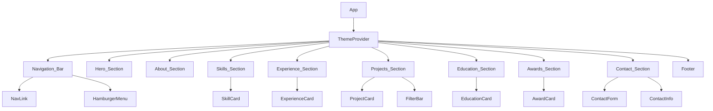

# Design Document: Developer Portfolio

## Overview

The developer portfolio is a single-page application (SPA) built with React 18+ and TypeScript, bootstrapped with Vite for fast development and optimized builds. The app uses CSS Modules for scoped, maintainable styling with CSS custom properties (variables) for theming. All portfolio data (personal info, skills, experience, projects, education, awards) is stored in static TypeScript data files, keeping the app simple with no backend dependency.

The architecture follows a component composition pattern with functional components and hooks. The app is organized into section-level components that each render a distinct part of the portfolio, composed from smaller reusable UI components.

## Architecture



### Technology Stack

- **Framework**: React 18+ with TypeScript
- **Build Tool**: Vite
- **Styling**: CSS Modules + CSS Custom Properties for theming
- **Form Handling**: Native React state (no external form library needed for a simple contact form)
- **Smooth Scrolling**: Native `scrollIntoView` API with `behavior: 'smooth'`
- **Intersection Observer**: Native API for active section detection in navigation
- **Testing**: Vitest + React Testing Library + fast-check (property-based testing)

### Design Decisions

1. **CSS Modules over styled-components**: CSS Modules provide scoped styles with zero runtime cost, better performance for a static portfolio, and native CSS features like custom properties for theming.
2. **Static data files over CMS/API**: Portfolio content changes infrequently. TypeScript data files provide type safety, no network latency, and simpler deployment.
3. **Vite over CRA**: Vite offers faster dev server startup, HMR, and optimized production builds.
4. **No routing library**: Single-page scroll-based navigation doesn't need React Router. Smooth scrolling via native APIs is sufficient.

## Components and Interfaces

### Section Components

Each section component receives its data via props or imports from the data layer.

```typescript
// Section component pattern
interface SectionProps {
  id: string;        // Used for scroll targeting
  className?: string;
}
```

#### NavigationBar
- Renders nav links for all sections
- Uses IntersectionObserver to track which section is visible and highlights the active link
- Collapses to hamburger menu below 768px viewport width
- Contains ThemeSwitcher toggle

#### HeroSection
- Displays developer name, title, tagline
- CTA buttons: "View Projects" (scrolls to projects), "Contact Me" (scrolls to contact)
- Social links (GitHub, LinkedIn) as icon links

#### AboutSection
- Professional summary paragraph
- Stats row: years of experience, projects completed, technologies
- Profile image with alt text

#### SkillsSection
- Groups skills by category (Backend, Frontend, Database, DevOps, Tools)
- Backend category rendered first/prominently
- Each skill rendered as SkillCard

#### ExperienceSection
- Renders ExperienceCard components in reverse chronological order
- Visual timeline with connecting line
- Current position visually distinguished (accent color indicator)

#### ProjectsSection
- FilterBar at top with technology tags + "All" option
- Grid of ProjectCard components
- Filtering logic: when a tag is selected, only projects containing that tech are shown

#### EducationSection
- List of EducationCard components in reverse chronological order

#### AwardsSection
- List of AwardCard components in reverse chronological order

#### ContactSection
- ContactForm component with validation
- ContactInfo component showing email and location

### Reusable UI Components

```typescript
// SkillCard
interface SkillCardProps {
  name: string;
  proficiency: number; // 0-100
  icon?: string;
}

// ExperienceCard
interface ExperienceCardProps {
  title: string;
  company: string;
  period: string;
  isCurrent: boolean;
  responsibilities: string[];
}

// ProjectCard
interface ProjectCardProps {
  title: string;
  description: string;
  techStack: string[];
  sourceUrl?: string;
  liveUrl?: string;
  imageUrl?: string;
}

// EducationCard
interface EducationCardProps {
  institution: string;
  degree: string;
  field: string;
  graduationYear: number;
}

// AwardCard
interface AwardCardProps {
  title: string;
  organization: string;
  date: string;
  description: string;
}

// ContactForm
interface ContactFormData {
  name: string;
  email: string;
  subject: string;
  message: string;
}

interface ContactFormErrors {
  name?: string;
  email?: string;
  subject?: string;
  message?: string;
}
```

### Hooks

```typescript
// useTheme - manages theme state and localStorage persistence
function useTheme(): {
  theme: 'light' | 'dark';
  toggleTheme: () => void;
}

// useActiveSection - tracks which section is currently in viewport
function useActiveSection(sectionIds: string[]): string;

// useContactForm - manages form state, validation, and submission
function useContactForm(): {
  formData: ContactFormData;
  errors: ContactFormErrors;
  isSubmitting: boolean;
  isSuccess: boolean;
  handleChange: (field: keyof ContactFormData, value: string) => void;
  handleSubmit: () => void;
  resetForm: () => void;
}
```

### ThemeProvider

```typescript
// ThemeContext provides theme state to all components
interface ThemeContextValue {
  theme: 'light' | 'dark';
  toggleTheme: () => void;
}
```

The ThemeProvider sets a `data-theme` attribute on the document root element. CSS custom properties defined under `[data-theme="light"]` and `[data-theme="dark"]` selectors handle all color switching.

## Data Models

All portfolio data is defined in TypeScript files under `src/data/`.

```typescript
// src/data/types.ts

export interface PersonalInfo {
  name: string;
  title: string;
  tagline: string;
  summary: string;
  email: string;
  location: string;
  github: string;
  linkedin: string;
  profileImage: string;
  stats: {
    yearsOfExperience: number;
    projectsCompleted: number;
    technologiesUsed: number;
  };
}

export interface Skill {
  name: string;
  proficiency: number; // 0-100
  icon?: string;
}

export interface SkillCategory {
  name: string;
  skills: Skill[];
}

export interface Experience {
  title: string;
  company: string;
  period: string;
  isCurrent: boolean;
  responsibilities: string[];
}

export interface Project {
  title: string;
  description: string;
  techStack: string[];
  sourceUrl?: string;
  liveUrl?: string;
  imageUrl?: string;
}

export interface Education {
  institution: string;
  degree: string;
  field: string;
  graduationYear: number;
}

export interface Award {
  title: string;
  organization: string;
  date: string;
  description: string;
}
```

### Data Validation

A `validatePortfolioData` function validates the data files at build/test time:

```typescript
function validatePortfolioData(data: {
  personalInfo: PersonalInfo;
  skills: SkillCategory[];
  experiences: Experience[];
  projects: Project[];
  education: Education[];
  awards: Award[];
}): ValidationResult;

interface ValidationResult {
  valid: boolean;
  errors: string[];
}
```

Validation rules:
- `personalInfo.name` must be non-empty
- `personalInfo.email` must match email format
- `Skill.proficiency` must be between 0 and 100
- `experiences` must be sorted in reverse chronological order (most recent first)
- `education` must be sorted by `graduationYear` descending
- `Project.techStack` must have at least one entry
- All required string fields must be non-empty

### Contact Form Validation

```typescript
function validateContactForm(data: ContactFormData): ContactFormErrors;
```

Validation rules:
- `name`: required, non-empty after trimming
- `email`: required, must match standard email regex pattern
- `subject`: required, non-empty after trimming
- `message`: required, non-empty after trimming, minimum 10 characters

### Project Filtering

```typescript
function filterProjects(projects: Project[], selectedTag: string | null): Project[];
```

- If `selectedTag` is `null` or `"All"`, return all projects
- Otherwise, return only projects whose `techStack` array includes the `selectedTag`


## Correctness Properties

*A property is a characteristic or behavior that should hold true across all valid executions of a system — essentially, a formal statement about what the system should do. Properties serve as the bridge between human-readable specifications and machine-verifiable correctness guarantees.*

### Property 1: Skills are grouped and display name with proficiency

*For any* set of skill categories and skills within them, rendering the Skills Section should group each skill under its correct category heading, and each Skill_Card should display the skill name and a proficiency indicator value matching the input data.

**Validates: Requirements 4.1, 4.2**

### Property 2: Data ordering — reverse chronological

*For any* list of experiences, education entries, or awards, the rendered output order should match reverse chronological order (most recent first), as determined by the date/year field of each entry.

**Validates: Requirements 5.1, 7.2, 8.2**

### Property 3: Experience card displays all required fields

*For any* experience entry with a title, company, period, and responsibilities list, the rendered ExperienceCard should contain all of those fields in its output.

**Validates: Requirements 5.2**

### Property 4: Project filtering correctness

*For any* list of projects and any selected filter tag, the filtered result should contain exactly those projects whose `techStack` includes the selected tag. When the filter is `null` or `"All"`, the result should equal the full project list.

**Validates: Requirements 6.3, 6.4**

### Property 5: Project card displays all required fields

*For any* project with a title, description, and techStack, the rendered ProjectCard should contain the project title, description, and all tech stack tags in its output.

**Validates: Requirements 6.2**

### Property 6: Education card displays all required fields

*For any* education entry with institution, degree, field, and graduation year, the rendered EducationCard should contain all of those fields in its output.

**Validates: Requirements 7.1**

### Property 7: Award card displays all required fields

*For any* award with title, organization, date, and description, the rendered AwardCard should contain all of those fields in its output.

**Validates: Requirements 8.1**

### Property 8: Contact form validation rejects invalid input

*For any* combination of contact form fields where one or more required fields are empty or invalid (e.g., malformed email), the `validateContactForm` function should return error messages for exactly those invalid fields and no others.

**Validates: Requirements 9.3**

### Property 9: Theme toggle is an involution

*For any* initial theme state, toggling the theme twice should return to the original theme state. That is, `toggle(toggle(theme)) === theme`.

**Validates: Requirements 10.1**

### Property 10: Theme persistence round-trip

*For any* theme value, saving it to localStorage and then reading it back should produce the same theme value.

**Validates: Requirements 10.2, 10.3**

## Error Handling

### Contact Form Errors
- Missing required fields: display inline validation messages below each field
- Invalid email format: display "Please enter a valid email address"
- Submission failure (network error): display a toast/banner error message, retain all form data so the user doesn't lose their input
- Submission success: display success message, clear the form

### Theme Errors
- If localStorage is unavailable or corrupted, fall back to system preference (`prefers-color-scheme` media query), then default to light theme
- If stored theme value is invalid, reset to light theme

### Data Errors
- If portfolio data files have validation errors, the `validatePortfolioData` function catches them at test time (not runtime), preventing deployment of broken data

### Image Loading Errors
- If a profile image or project image fails to load, display a placeholder/fallback image

## Testing Strategy

### Testing Framework

- **Unit & Component Testing**: Vitest + React Testing Library
- **Property-Based Testing**: fast-check (integrated with Vitest)
- **Minimum iterations**: 100 per property test

### Unit Tests

Unit tests cover specific examples, edge cases, and integration points:
- Component rendering with sample data
- Hamburger menu toggle behavior
- Contact form submission flow (success and error paths)
- Theme toggle UI interaction
- Navigation link rendering
- Semantic HTML verification
- Accessibility attributes (alt text, ARIA labels)

### Property-Based Tests

Each correctness property from the design is implemented as a property-based test using fast-check. Tests are annotated with their property number and requirements reference.

Tag format: **Feature: developer-portfolio, Property {number}: {property_text}**

Property tests validate:
1. Skills grouping and card content (Property 1)
2. Reverse chronological ordering of experiences, education, awards (Property 2)
3. Experience card field completeness (Property 3)
4. Project filtering logic (Property 4)
5. Project card field completeness (Property 5)
6. Education card field completeness (Property 6)
7. Award card field completeness (Property 7)
8. Contact form validation correctness (Property 8)
9. Theme toggle involution (Property 9)
10. Theme persistence round-trip (Property 10)

### Test Organization

```
src/
├── components/
│   ├── __tests__/
│   │   ├── NavigationBar.test.tsx
│   │   ├── SkillCard.test.tsx
│   │   ├── ExperienceCard.test.tsx
│   │   ├── ProjectCard.test.tsx
│   │   ├── ContactForm.test.tsx
│   │   └── ...
├── hooks/
│   ├── __tests__/
│   │   ├── useTheme.test.ts
│   │   └── useContactForm.test.ts
├── utils/
│   ├── __tests__/
│   │   ├── validation.test.ts
│   │   ├── filtering.test.ts
│   │   └── validation.property.test.ts
│   │   └── filtering.property.test.ts
│   │   └── theme.property.test.ts
│   │   └── ordering.property.test.ts
│   │   └── components.property.test.tsx
```
